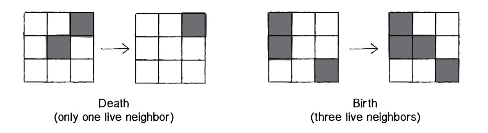
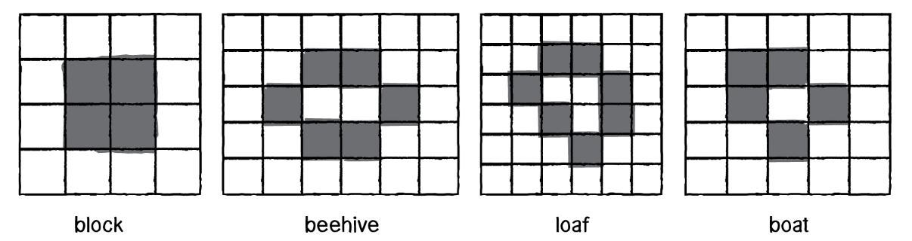
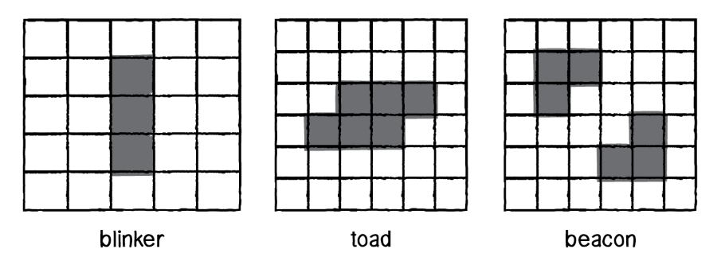

# Conway's Game of Life

The Game of Life (also known simply as Life) is an example of a [cellular automaton][CA] and a zero-player game, that takes place on an infinite 2D grid/ board in which each cells can have either of 2 states; ON ('alive') or OFF ('dead').

Figure: Game-of-Life-Pentomino

The state of each cell is determined by a set of rules that depends on the state of each cell's neighbourhood (the 8 cells adjacent to the particular cell).

Following the specification given initially, patterns evolve over time across the Grid, requiring no further user input, (thus the 'zero-player' Game).

## Rules

The game takes place in discrete time, with the state of each cell at time (t) being determined by its own state and the states of its eight immediate neighbours at time (t-1).

The simple rules of life are:

- Death :- If a cell is alive at time (t-1), it will die at time (t) under following circumstances:
  - Overpopulation :- If the cell has 4 or more alive neighbours, it dies.
  - Loneliness :- If a cell has 1 or fewer alive neighbour, it dies.

- Birth :- If a cell is dead at time (t-1), it willcome to life at time (t), if it has "exactly" 3 alive neighbours.

- Statis :- In all other cases, the cell does not change it's state. To be more precise:
  - Staying alive :- If a cell is alive at time (t-1) and has exactly2 or 3 live neighbours, then it stays alive.
  - Staying dead :- If a cell is dead at time (t-1) and has anything other than 3 live neighbours, it stays dead.
  

## Patterns

As mentioned earlier, following the initial configuration, different patterns evolve over time. While some patterns change over time, other remains static and never change.

- Still Life :- a stable pattern in which no changes occur after the initial configuration.
  

- Oscillators :- patterns that change over time but repeat themselves after particular number of iterations.
  

- Spaceships :- patterns that move about the grid from generation to generation.
  

[CA]: <https://mathworld.wolfram.com/CellularAutomaton.html#:~:text=A%20cellular%20automaton%20is%20a,many%20time%20steps%20as%20desired.>
